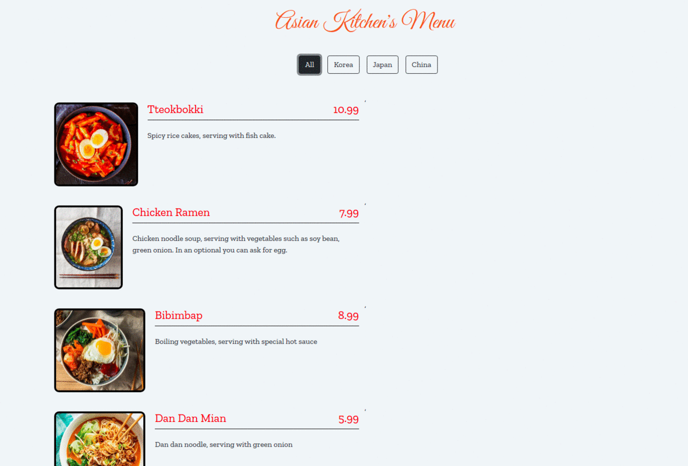

# Patika.dev - Javascript Homework 3 - Asian Kitchen's Menu Project

In this project, I've prepared the ```app.js``` Javascript script in order to manange the transactions among the body of the ```index.html``` 

Each dish object are created by ```map``` function through using their keys in order to add into template html object.

The buttons which are ```All```,```Korea```,```Japan``` and ```China``` used for filtering the category of dishes. Filtering operations are applied basically through ```reduce``` function.

Failures:

- Dishes couldn't placed properly comparing to original example. See: ```https://ayerdelen.github.io/AsianKitchen/```


The result:



